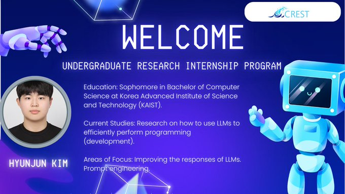

🎉 Join us in welcoming Hyunjun Kim, another student researcher!

📷 Hyunjun is a sophomore in Computer Science at KAIST and also joined us through the Undergraduate Research Internship Program. He’s diving into research on optimizing the use of LLMs for programming tasks, with a focus on enhancing LLM responses and mastering prompt engineering.

We’re excited to have you with us, Hyunjun! Here’s to a productive and innovative journey ahead. 📷 [#WelcomeToTheTeam](https://x.com/hashtag/WelcomeToTheTeam?src=hashtag_click) [#CREST](https://x.com/hashtag/CREST?src=hashtag_click) [#LLMResearch](https://x.com/hashtag/LLMResearch?src=hashtag_click) [#UndergraduateResearchInternshipProgram](https://x.com/hashtag/UndergraduateResearchInternshipProgram?src=hashtag_click)

