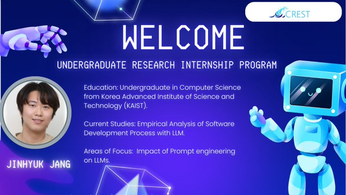

🎉 Exciting news! Join us in welcoming Jinhyuk Jang, our newest student researcher!

📷 Jinhyuk is joining us through the Undergraduate Research Internship Program, bringing his expertise in the empirical analysis of software development processes with LLMs. He’s currently pursuing his Computer Science degree at Korea Advanced Institute of Science and Technology (KAIST).

Welcome aboard, Jinhyuk! We’re thrilled to embark on this research journey with you. Let’s make it a great one! 📷 [#LLM](https://x.com/hashtag/LLM?src=hashtag_click) [#LLMPromptEngineering](https://x.com/hashtag/LLMPromptEngineering?src=hashtag_click) [#StudentProjects](https://x.com/hashtag/StudentProjects?src=hashtag_click)

