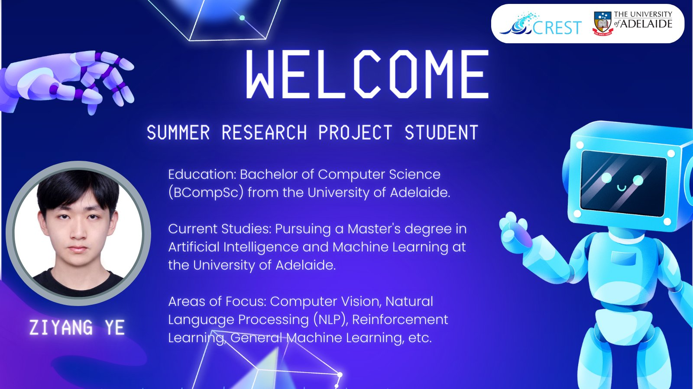

🎉 Join us in extending a warm welcome to Ziyang Ye, the newest addition to the CREST family!

📢 We're thrilled to have Ziyang on board as a Summer Research Project Student, bringing exceptional research skills in Computer Vision, NLP and RL.

Welcome to the team, Ziyang Ye. Looking forward to an incredible and collaborative experience ! 👏

[@newteammember]https://twitter.com/hashtag/newteammember?src=hashtag_click)

[@crest](https://twitter.com/hashtag/crest?src=hashtag_click)

[@summerresearchproject](https://twitter.com/hashtag/summerresearchproject?src=hashtag_click)

