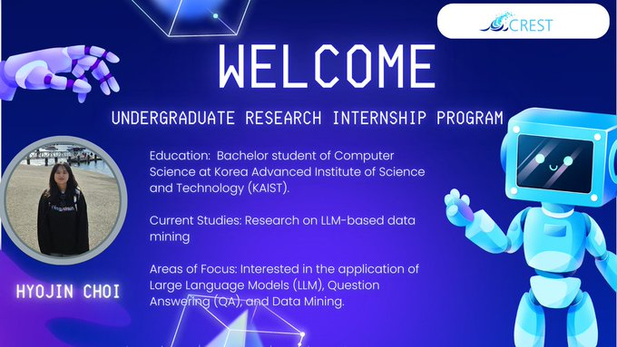

🎉 Join us in welcoming another talented student researcher, Hyojin Choi, to our team!

📷 Hyojin is currently pursuing a Bachelor's degree in Computer Science at KAIST and is conducting research on LLM-based data mining. Her areas of focus include the application of Large Language Models (LLM), Question Answering (QA), and Data Mining.

We’re thrilled to have you on board and look forward to the innovative contributions you’ll bring to our projects. 📷 [#WelcomeToTheTeam](https://x.com/hashtag/WelcomeToTheTeam?src=hashtag_click) [#CREST](https://x.com/hashtag/CREST?src=hashtag_click) [#LLMResearch](https://x.com/hashtag/LLMResearch?src=hashtag_click)

