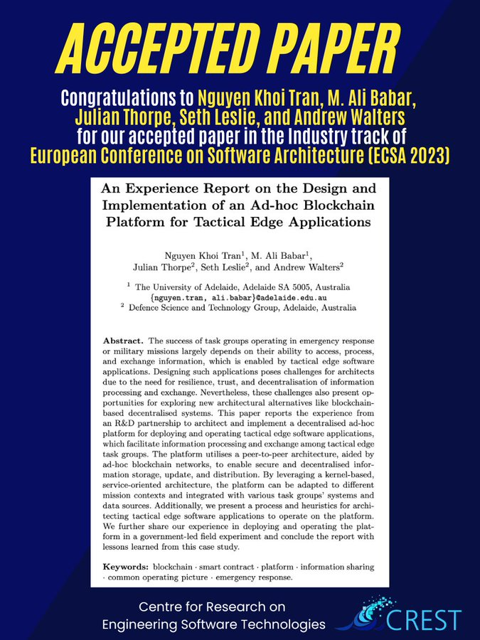

🎉New Paper Accepted !

Excited to share our "Experience Report on the Design & Implementation of an Ad-hoc [#Blockchain](https://twitter.com/hashtag/Blockchain?src=hashtag_click) Platform for Tactical Edge Applications" in collab [@DefenceScience](https://twitter.com/DefenceScience) has been accepted in the industry track of [@ECSACONF](https://twitter.com/ECSACONF)!

📰 Preprint [bit.ly/3XtCw8K](bit.ly/3XtCw8K)

