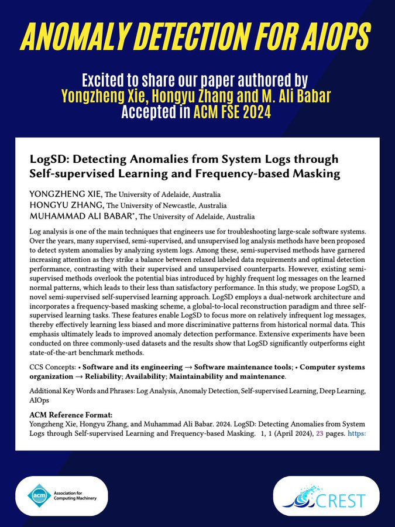

🚀 Exciting News! Paper Accepted for Publication!

Thrilled to announce that our paper, "LogSD: Detecting Anomalies from System Logs through Self-supervised Learning and Frequency-based Masking" authored by Yongzheng Xie, Professor Hongyu Zhang, and Professor Ali Babar 
@alibabar
  has been accepted in ACM #FSE2024!

🔎 This work introduces a semi-supervised approach, LogSD, for detecting anomalies in system logs. LogSD employs a dual-network architecture and incorporates a frequency-based masking scheme, a global-to-local reconstruction paradigm, and three self-supervised learning tasks.

🎯 These feature extraction frameworks enable LogSD to focus more on relatively infrequent log messages, thereby effectively learning less biased and more discriminative patterns from historical normal data. Our experimental evaluations demonstrate LogSD's superior performance over current state-of-the-art approaches across three widely-used real-world datasets.

🚩 This work will facilitate to enhance system reliability, particularly in critical domains like cloud computing and microservices, by enabling more efficient and effective fault and failure detection. We also aspire to catalyze increased interest from more researchers in the AIOPs domain!

For more information, you can read the full paper here: [#https://arxiv.org/abs/2404.11294](https://arxiv.org/abs/2404.11294)

[#Anomalydetection](https://twitter.com/hashtag/Anomalydetection?src=hashtag_click)
[#LogAnalysis](https://twitter.com/hashtag/LogAnalysis?src=hashtag_click)
[#ALOPs](https://twitter.com/hashtag/ALOPs?src=hashtag_click)
[#FSE2024](https://twitter.com/hashtag/FSE2024?src=hashtag_click)  

