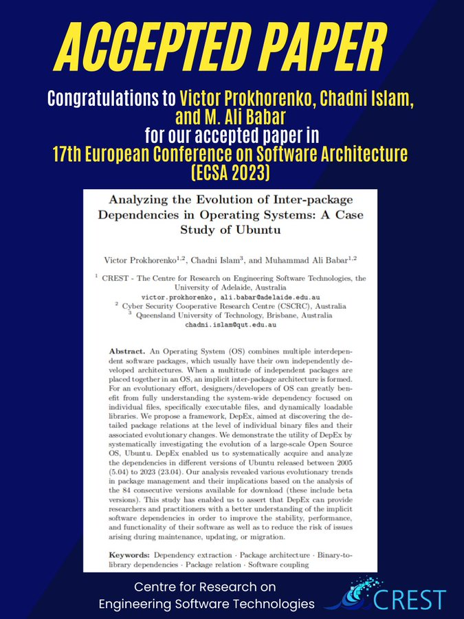

🎉New Paper Accepted !

Thrilled to announce that our latest paper, [#Empirical](https://twitter.com/hashtag/Empirical?src=hashtag_click) analysis of inter-package [#dependencies](https://twitter.com/hashtag/dependencies?src=hashtag_click) architecture and evolution: A Case Study of [#Ubuntu](https://twitter.com/hashtag/Ubuntu?src=hashtag_click), has been accepted by 
[@ECSACONF](https://twitter.com/ECSACONF) 2023! 🌟 [#SoftwareArchitecture](https://twitter.com/hashtag/SoftwareArchitecture?src=hashtag_click)

