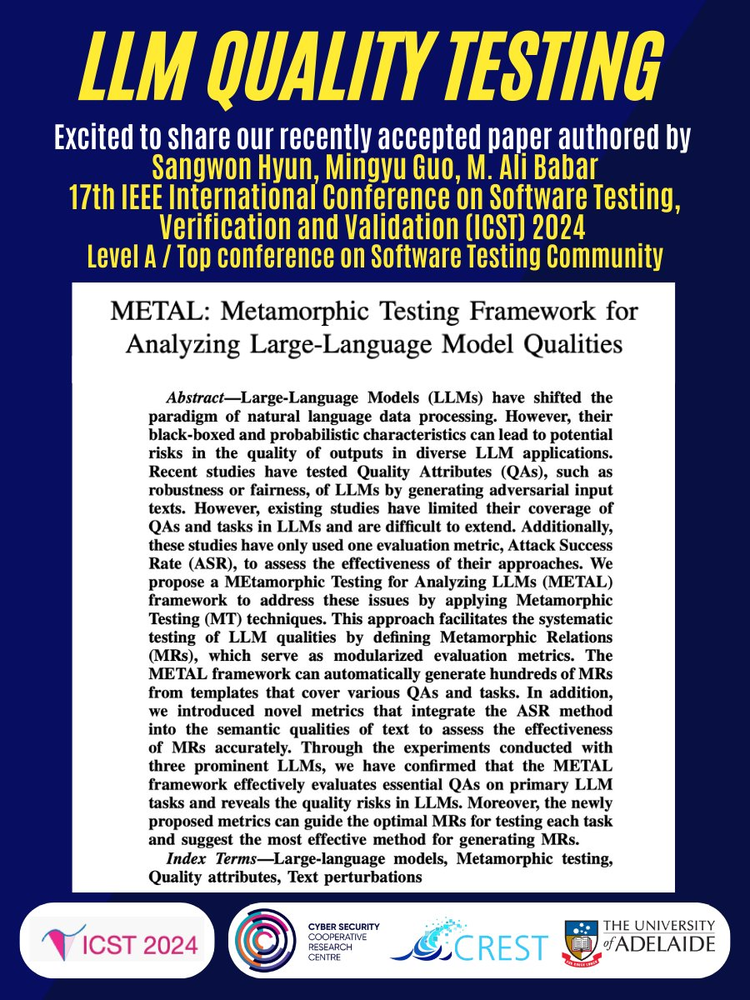

New paper accepted! 🎉 🎉 🎉
Excited to share our paper, "METAL: Metamorphic Testing Framework for Analyzing Large-Language Model Qualities" by Sangwon Hyun, Mingyu Guo and [@alibabar](https://twitter.com/alibabar) has been accepted in the 17th IEEE International Conference on Software Testing, Verification and Validation (ICST) 2024 , a Level-A conference within software testing community.

This paper proposes an automated framework, MEtamorphic Testing for Analyzing Large-Language (METAL), to evaluate essential quality attributes of primary tasks in different LLMs. It facilitates the systematic testing of LLM qualities by defining Metamorphic Relations (MRs), which serve as modularized evaluation metrics. The METAL framework can automatically generate hundreds of MRs from templates that cover various QAs and tasks. We believe that this framework is the first open and executable framework to directly evaluate and calculate the comprehensive qualities of LLM outputs utilizing unlimited input text space.

🔗 Full paper can be accessed through [arxiv.org/abs/2312.06056](arxiv.org/abs/2312.06056).

[#largelanguagemodels](https://twitter.com/hashtag/largelanguagemodels?src=hashtag_click)
[#Metamorphictesting](https://twitter.com/hashtag/Metamorphictesting?src=hashtag_click)
[#Qualityattributes](https://twitter.com/hashtag/Qualityattributes?src=hashtag_click)
[#Textperturbations](https://twitter.com/hashtag/Textperturbations?src=hashtag_click)
[#LLMQualityTesting](https://twitter.com/hashtag/LLMQualityTesting?src=hashtag_click)

