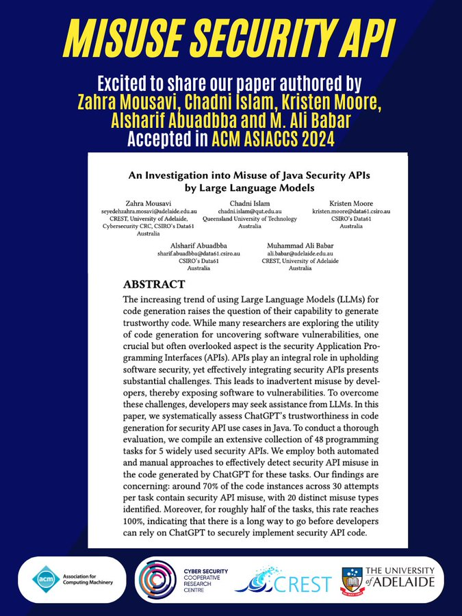

🚀 Exciting News! Paper Accepted for Publication!

Thrilled to announce that our paper, "An Investigation into Misuse of Java Security APIs by Large Language Models" authored by Zahra Mousavi, Chadni Islam [@Chadni] (https://twitter.com/_Chadni_), Kristen Moore, Alsharif Abuadbba, Ali Babar [@alibabar](https://twitter.com/alibabar) has been accepted in AsiaCCS 2024 (Core A)!

🛡️ The surge in using Large Language Models (LLMs) for code generation has sparked crucial discussions about code trustworthiness. Our research delves into this topic by focusing on the integration of security APIs. APIs are fundamental for software security, yet their effective integration poses significant challenges, often resulting in inadvertent misuse and vulnerabilities.

🎯 To address this, we investigated ChatGPT's capabilities in generating secure code for security API use cases in Java. Through a comprehensive evaluation involving 48 programming tasks and 5 widely used security APIs, we employed automated and manual approaches to detect security API misuse in ChatGPT-generated code.

🌐💡 Our findings reveal a concerning trend: Approximately 70% of instances contain security API misuse, a clear indication of the potential for security vulnerabilities in LLM-generated code.

[#AI](https://twitter.com/hashtag/AI?src=hashtag_click)
[#CodeGeneration](https://twitter.com/hashtag/CodeGeneration?src=hashtag_click)
[#SoftwareSecurity](https://twitter.com/hashtag/SoftwareSecurity?src=hashtag_click)
[#APIs](https://twitter.com/hashtag/APIs?src=hashtag_click)
[#ChatGPT](https://twitter.com/hashtag/ChatGPT?src=hashtag_click)
[#Trustworthiness](https://twitter.com/hashtag/Trustworthiness?src=hashtag_click)
[#Java](https://twitter.com/hashtag/Java?src=hashtag_click)
[#AsiaCCS2024](https://twitter.com/hashtag/AsiaCCS2024?src=hashtag_click)

