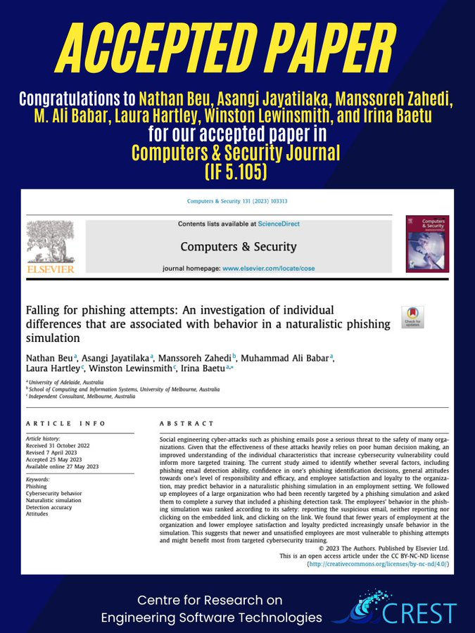

🎉New Paper Accepted !

Our paper, 'Falling for Phishing Attempts: An Investigation of Individual Differences Associated with Behavior in a Naturalistic Phishing Simulation,' has been published in the Computers and Security Journal ! 🚀 [#CyberSecurity](https://twitter.com/hashtag/CyberSecurity?src=hashtag_click) [#PhishingAttacks](https://twitter.com/hashtag/PhishingAttacks?src=hashtag_click) [#CREST](https://twitter.com/hashtag/CREST?src=hashtag_click)

