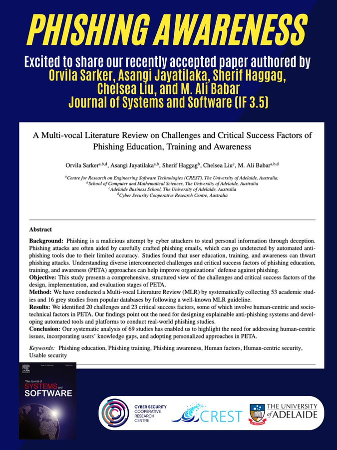

🎉New Paper Accepted !

Excited to share our paper: A Multi-vocal Literature Review on Challenges & Critical Success Factors of Phishing Education, Training & Awareness by [@OrvilaSarker](https://twitter.com/OrvilaSarker) [@DrAsangiJ](https://twitter.com/DrAsangiJ) [@sherif_haggag](https://twitter.com/sherif_haggag)
, Chelsea Liu& [@alibabar](https://twitter.com/alibabar) has been accepted in [@JSSoftware](https://twitter.com/JSSoftware) [#Human_factor](https://twitter.com/hashtag/Human_factor?src=hashtag_click)

