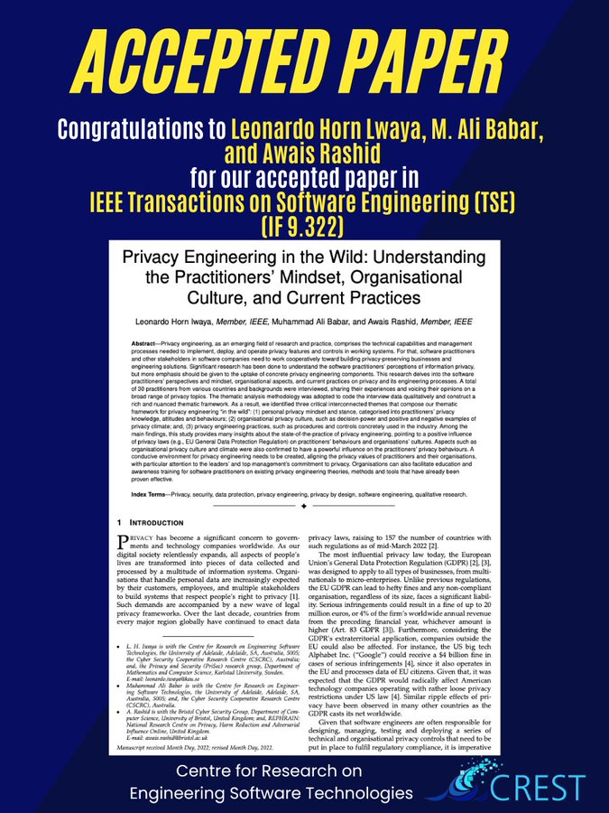

🎉New Paper Accepted !

Delighted to share our paper on [#PrivacyEngineering](https://twitter.com/hashtag/PrivacyEngineering?src=hashtag_click) was accepted in the premier [#TSE](https://twitter.com/hashtag/TSE?src=hashtag_click) journal. We distilled insights into practitioners'/org. [#privacy](https://twitter.com/hashtag/privacy?src=hashtag_click) mindset/culture, privacy engineering practices & laws' influence.🔒🌐

📰 Preprint:[arxiv.org/abs/2211.08916](https://arxiv.org/abs/2211.08916)

