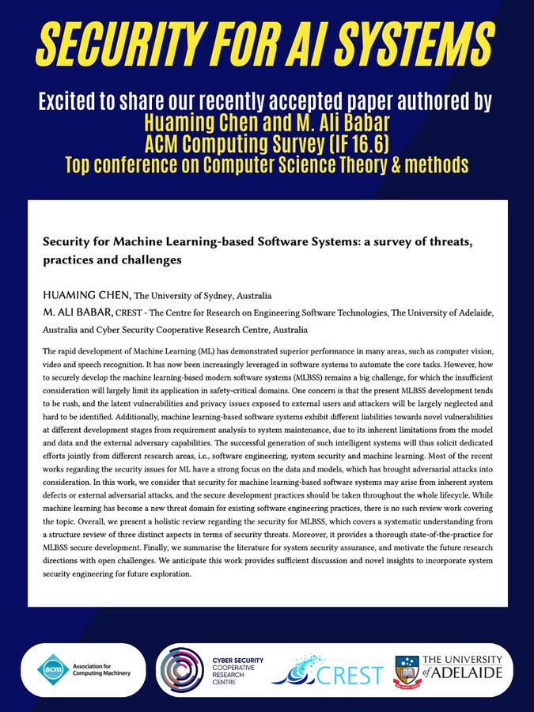

New paper accepted! ⛳️
 
🎉 Exciting News! Thrilled to share our recent research on machine learning-based modern software systems, "Security for Machine Learning-based Software Systems: a survey of threats, practices, and challenges" by Huaming Chen and 
[@alibabar](https://twitter.com/alibabar), has been accepted by ACM Computing Survey (IF 16.6)! 🚀📑

Amidst the prominence of Machine Learning in modern software systems, securing its development is paramount. This paper reviews the challenges in securely developing Machine Learning-based Modern Software Systems (MLBSS), particularly crucial for safety-critical domains. 🛡️💻

In this work, we present a holistic review regarding the the security threats, state-of-the-practice for secure development, and outlines future research directions in MLBSS. Emphasizing that MLBSS security is integral throughout the lifecycle, we bridge the gap in existing literature with a comprehensive exploration. 🌐

Welcome to join us in exploring more! 🌟

[#PaperAccepted](https://twitter.com/hashtag/PaperAccepted?src=hashtag_click)
[#machinelearning](https://twitter.com/hashtag/machinelearning?src=hashtag_click)
[#softwaresystems](https://twitter.com/hashtag/softwaresystems?src=hashtag_click)
[#SoftwareSecurity](https://twitter.com/hashtag/SoftwareSecurity?src=hashtag_click)

