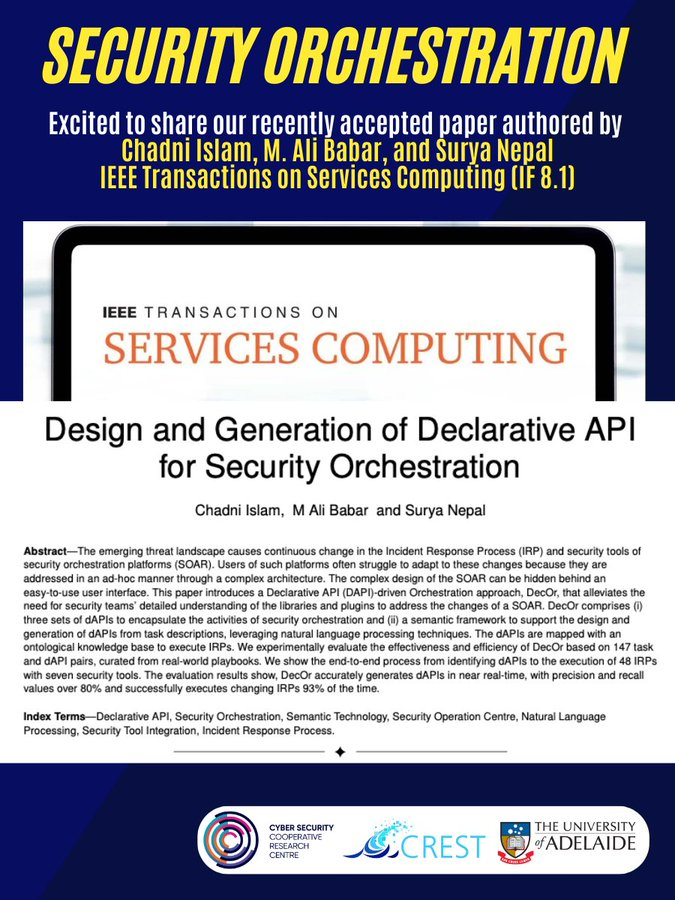

🎉New Paper Accepted !

Excited to share our paper, "Design and Generation of Declarative API for Security Orchestrations" by [@_Chadni_](https://twitter.com/_Chadni_), [@alibabar](https://twitter.com/alibabar) and Surya Nepal has been accepted in the IEEE Transactions on Services Computing, one of the top journals in the service community.

This paper introduces "DecOr" : a Declarative API driven Orchestration approach to alleviate the need for detailed understanding of the libraries and plugins to address changes of Security Orchestration Platforms. Main highlights of this work include:
1.Three sets of Declarative APIs to encapsulate activities of security orchestration.
2.A semantic framework to generate Declarative APIs from task descriptions leveraging natural language processing techniques.

[#securityorchestration](https://twitter.com/hashtag/securityorchestration?src=hashtag_click)
[#securityoperationscenter](https://twitter.com/hashtag/securityoperationscenter?src=hashtag_click)
[#naturallanguageprocessing](https://twitter.com/hashtag/naturallanguageprocessing?src=hashtag_click)
[#crest](https://twitter.com/hashtag/crest?src=hashtag_click)

