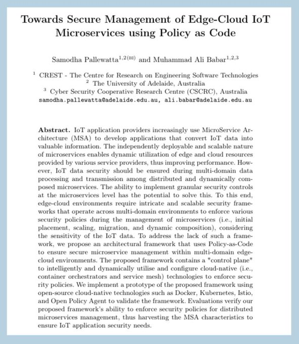

🚀 Excited to share that our work on Policy-as-Code for secure management of edge-cloud microservices has been accepted at the European Conference on Software Architecture 2024 (ECSA2024 - Core A)!

Our work presents an architectural framework and a prototype for integrating and enforcing granular security policies during placement, scaling, migration, and dynamic composition of IoT microservices.

We bring our proposed framework to life with a prototype built using cutting-edge cloud-native technologies like [#Docker](https://x.com/hashtag/Docker?src=hashtag_click), [#Kubernetes](https://x.com/hashtag/Kubernetes?src=hashtag_click), [#Istio](https://x.com/hashtag/Istio?src=hashtag_click), and [#OpenPolicyAgent](https://x.com/hashtag/OpenPolicyAgent?src=hashtag_click).

🔍 To learn more about the framework and implementation, check out our preprint here: [#https://arxiv.org/abs/2406.18813](https://arxiv.org/abs/2406.18813)

[#ECSA2024](https://x.com/hashtag/ECSA2024?src=hashtag_click)
[#DevSecOps](https://x.com/hashtag/DevSecOps?src=hashtag_click)
[#PaC](https://x.com/hashtag/PaC?src=hashtag_click)
[#Microservices](https://x.com/hashtag/Microservices?src=hashtag_click)  
[#DistributedComputing](https://x.com/hashtag/DistributedComputing?src=hashtag_click)
[#IoTSecurity](https://x.com/hashtag/IoTSecurity?src=hashtag_click)

