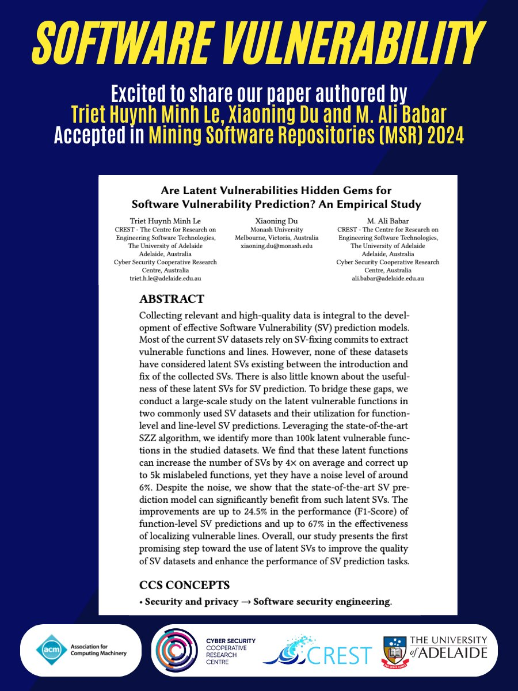

🎉 Exciting News! 

📚 Our work 'Are Latent Vulnerabilities Hidden Gems for Software Vulnerability Prediction? An Empirical Study'  authored by Triet Le 
[@lhmtriet](https://twitter.com/lhmtriet), Xiaoning Du and Ali Babar [@alibabar](https://twitter.com/alibabar) has been accepted in Mining Software Repositories (MSR) 2024 ! 🚀🔒

🔍 We studies on the latent vulnerable functions in two commonly used Software Vulnerability (SV) datasets and their utilization for function level and line-level SV predictions! Our large-scale study using the SZZ algorithm uncovered 100k+ latent vulnerable functions, boosting SV predictions by 4× on average.

🚧  This work demonstrates the positive impacts of using SZZ-based latent SVs in the studied datasets for SV prediction. Our state-of-the-art SV prediction model shows a remarkable 24.5% increase in function-level SV prediction performance and a whopping 67% improvement in localizing vulnerable lines.

🌐 Bridging gaps, enhancing datasets, and fortifying SV prediction tasks – a promising step towards a more secure future! 🛡️💻

📜Full paper available at: [#https://arxiv.org/abs/2401.11105](https://arxiv.org/abs/2401.11105)
🔖 Data and code is available at: [#https://github.com/lhmtriet/Latent-Vulnerability](https://github.com/lhmtriet/Latent-Vulnerability)

[#CyberSecurity](https://twitter.com/hashtag/CyberSecurity?src=hashtag_click)
[#Research](https://twitter.com/hashtag/Research?src=hashtag_click)
[#SVPrediction](https://twitter.com/hashtag/SVPrediction?src=hashtag_click)
[#DataScience](https://twitter.com/hashtag/DataScience?src=hashtag_click)
[#Innovation](https://twitter.com/hashtag/Innovation?src=hashtag_click)
[#InfoSec](https://twitter.com/hashtag/InfoSec?src=hashtag_click)
[#TechBreakthroughs](https://twitter.com/hashtag/TechBreakthroughs?src=hashtag_click)
[#PaperPublished](https://twitter.com/hashtag/PaperPublished?src=hashtag_click)

