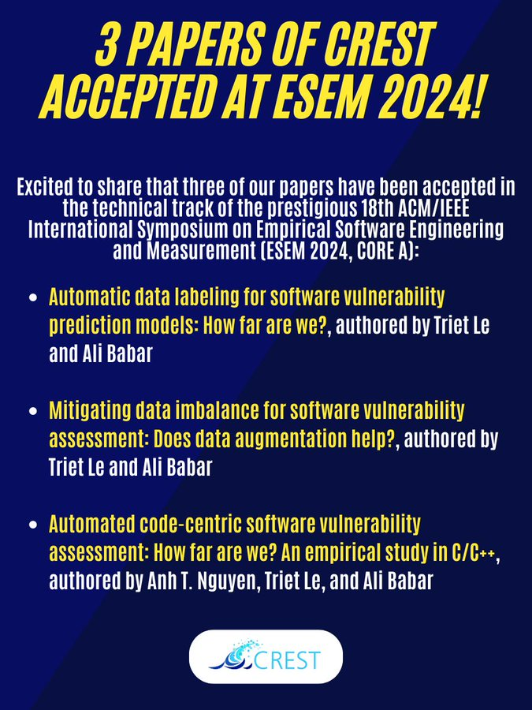

Excited to share that CREST has 3 accepted full papers in [#software](https://x.com/hashtag/software?src=hashtag_click) [#security](https://x.com/hashtag/security?src=hashtag_click) at 
[@ESEM_conf](https://x.com/ESEM_conf) :
👉 Quality and use of auto-labeled data for software [#vulnerability](https://x.com/hashtag/vulnerability?src=hashtag_click) prediction
👉 Understanding and mitigation of [#data](https://x.com/hashtag/data?src=hashtag_click) imbalance for vulnerability assessment using data augmentation
👉 Comparison and utilization of [#MachineLearning](https://x.com/hashtag/MachineLearning?src=hashtag_click) and [#DeepLearning](https://x.com/hashtag/DeepLearning?src=hashtag_click) for advancing code-centric assessment of vulnerability [#exploitability](https://x.com/hashtag/exploitability?src=hashtag_click), [#impact](https://x.com/hashtag/impact?src=hashtag_click), and [#severity](https://x.com/hashtag/severity?src=hashtag_click)

The studies support the development of [#effective](https://x.com/hashtag/effective?src=hashtag_click), [#efficient](https://x.com/hashtag/efficient?src=hashtag_click), and [#trustworthy](https://x.com/hashtag/trustworthy?src=hashtag_click)prediction models to detect and assess vulnerabilities, enabling early vulnerability fixing.

Congrats to all authors [@alibabar](https://x.com/alibabar) [@lhmtriet](https://x.com/lhmtriet) Anh The Nguyen 🎉🥳 Special thanks to @CSCRCoz for the support.

Preprints and more details are coming soon. Please stay tuned.

